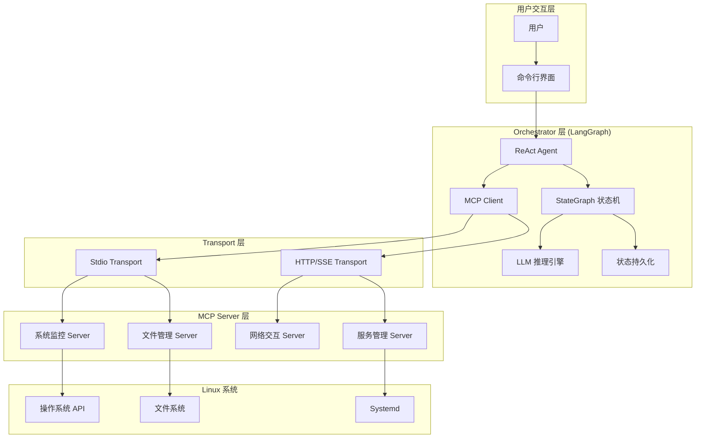
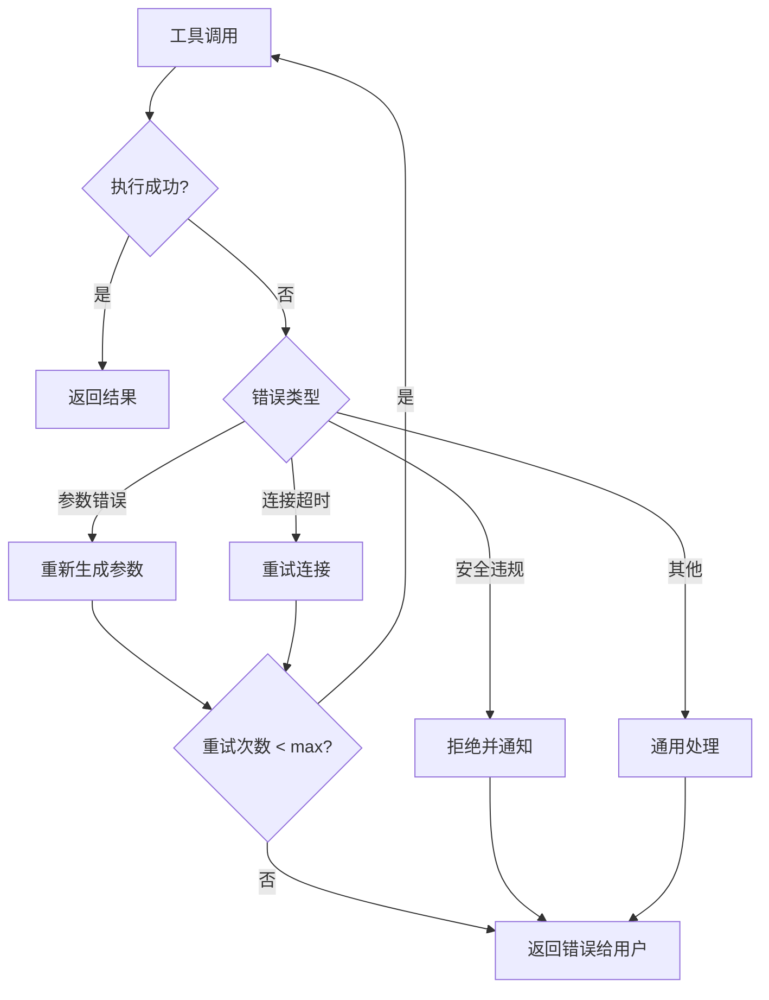

# Design Document: LangGraph + MCP Linux 智能体系统

## Overview

本系统采用分层架构设计，将智能体的"思考"能力（LangGraph Orchestrator）与"执行"能力（MCP Server）彻底解耦。核心设计理念是：

1. **Orchestrator 层**：基于 LangGraph 的 StateGraph 实现 ReAct 循环，负责意图理解、任务规划、状态管理和错误恢复
2. **MCP Client 层**：集成在 Orchestrator 中，负责工具发现、参数验证和跨进程通信
3. **MCP Server 层**：独立进程运行的工具服务，暴露系统监控、文件管理、网络交互等能力
4. **Transport 层**：支持 Stdio 和 HTTP/SSE 两种通信方式

## Architecture



## Components and Interfaces

### 1. Orchestrator 组件

#### 1.1 AgentState (状态定义)

```python
from typing import TypedDict, Annotated, Sequence
from langchain_core.messages import BaseMessage
from langgraph.graph.message import add_messages

class AgentState(TypedDict):
    """智能体状态定义"""
    messages: Annotated[Sequence[BaseMessage], add_messages]  # 对话历史
    current_task: str  # 当前任务描述
    tool_results: list[dict]  # 工具调用结果
    pending_approval: bool  # 是否等待人工审批
    error_count: int  # 连续错误计数
```

#### 1.2 ReActGraph (核心图结构)

```python
from langgraph.graph import StateGraph, END

class ReActGraph:
    """ReAct 循环图定义"""
    
    def build_graph(self) -> StateGraph:
        graph = StateGraph(AgentState)
        
        # 添加节点
        graph.add_node("reason", self.reason_node)      # 推理节点
        graph.add_node("act", self.act_node)            # 行动节点
        graph.add_node("approve", self.approve_node)    # 审批节点
        graph.add_node("respond", self.respond_node)    # 响应节点
        
        # 添加边
        graph.set_entry_point("reason")
        graph.add_conditional_edges(
            "reason",
            self.should_continue,
            {
                "act": "act",
                "approve": "approve",
                "respond": "respond"
            }
        )
        graph.add_edge("act", "reason")
        graph.add_edge("approve", "reason")
        graph.add_edge("respond", END)
        
        return graph
```

#### 1.3 LLMEngine (模型抽象层)

```python
from abc import ABC, abstractmethod
from langchain_core.language_models import BaseChatModel

class LLMEngine(ABC):
    """LLM 引擎抽象接口"""
    
    @abstractmethod
    def invoke(self, messages: list, tools: list) -> dict:
        """调用 LLM 进行推理"""
        pass
    
    @abstractmethod
    def bind_tools(self, tools: list) -> BaseChatModel:
        """绑定工具到模型"""
        pass

class OpenAIEngine(LLMEngine):
    """OpenAI GPT 实现"""
    pass

class ClaudeEngine(LLMEngine):
    """Anthropic Claude 实现"""
    pass

class DeepSeekEngine(LLMEngine):
    """DeepSeek 实现"""
    pass
```

### 2. MCP Client 组件

#### 2.1 MCPClient (客户端接口)

```python
from dataclasses import dataclass
from typing import Protocol

@dataclass
class ToolSchema:
    """工具元数据"""
    name: str
    description: str
    parameters: dict  # JSON Schema 格式

class MCPClient(Protocol):
    """MCP 客户端协议"""
    
    async def connect(self, server_config: dict) -> None:
        """连接到 MCP Server"""
        ...
    
    async def list_tools(self) -> list[ToolSchema]:
        """获取可用工具列表"""
        ...
    
    async def call_tool(self, name: str, arguments: dict) -> dict:
        """调用工具"""
        ...
    
    async def disconnect(self) -> None:
        """断开连接"""
        ...
```

#### 2.2 Transport 实现

```python
class StdioTransport:
    """标准输入输出传输"""
    
    def __init__(self, command: str, args: list[str]):
        self.command = command
        self.args = args
        self.process: subprocess.Popen = None
    
    async def start(self) -> None:
        """启动子进程"""
        pass
    
    async def send(self, message: dict) -> dict:
        """发送 JSON-RPC 消息"""
        pass

class HTTPTransport:
    """HTTP/SSE 传输"""
    
    def __init__(self, base_url: str):
        self.base_url = base_url
        self.session: aiohttp.ClientSession = None
    
    async def connect(self) -> None:
        """建立 HTTP 连接"""
        pass
    
    async def send(self, message: dict) -> dict:
        """发送 JSON-RPC 消息"""
        pass
```

### 3. MCP Server 组件

#### 3.1 BaseMCPServer (服务端基类)

```python
from mcp.server import Server
from mcp.types import Tool, TextContent

class BaseMCPServer:
    """MCP Server 基类"""
    
    def __init__(self, name: str):
        self.server = Server(name)
        self._register_handlers()
    
    def _register_handlers(self):
        @self.server.list_tools()
        async def list_tools() -> list[Tool]:
            return self.get_tools()
        
        @self.server.call_tool()
        async def call_tool(name: str, arguments: dict) -> list[TextContent]:
            return await self.execute_tool(name, arguments)
    
    @abstractmethod
    def get_tools(self) -> list[Tool]:
        """返回工具定义"""
        pass
    
    @abstractmethod
    async def execute_tool(self, name: str, arguments: dict) -> list[TextContent]:
        """执行工具"""
        pass
```

#### 3.2 SystemMonitorServer (系统监控服务)

```python
class SystemMonitorServer(BaseMCPServer):
    """系统监控 MCP Server"""
    
    def get_tools(self) -> list[Tool]:
        return [
            Tool(
                name="get_system_stats",
                description="获取系统状态信息（CPU、内存、磁盘）",
                inputSchema={
                    "type": "object",
                    "properties": {
                        "include_processes": {
                            "type": "boolean",
                            "description": "是否包含进程列表"
                        }
                    }
                }
            )
        ]
    
    async def execute_tool(self, name: str, arguments: dict) -> list[TextContent]:
        if name == "get_system_stats":
            return await self._get_system_stats(arguments)
```

#### 3.3 FileManagerServer (文件管理服务)

```python
class FileManagerServer(BaseMCPServer):
    """文件管理 MCP Server"""
    
    def __init__(self, sandbox_path: str):
        super().__init__("file-manager")
        self.sandbox_path = Path(sandbox_path).resolve()
    
    def _validate_path(self, path: str) -> Path:
        """验证路径是否在沙盒内"""
        full_path = (self.sandbox_path / path).resolve()
        if not str(full_path).startswith(str(self.sandbox_path)):
            raise SecurityError("路径超出沙盒范围")
        return full_path
    
    def get_tools(self) -> list[Tool]:
        return [
            Tool(name="read_file", ...),
            Tool(name="write_file", ...),
            Tool(name="list_directory", ...)
        ]
```

#### 3.4 NetworkServer (网络交互服务)

```python
class NetworkServer(BaseMCPServer):
    """网络交互 MCP Server"""
    
    def get_tools(self) -> list[Tool]:
        return [
            Tool(
                name="fetch_api",
                description="发起 HTTP 请求",
                inputSchema={
                    "type": "object",
                    "properties": {
                        "url": {"type": "string"},
                        "method": {"type": "string", "enum": ["GET", "POST", "PUT", "DELETE"]},
                        "headers": {"type": "object"},
                        "body": {"type": "string"}
                    },
                    "required": ["url", "method"]
                }
            )
        ]
```

#### 3.5 ServiceManagerServer (服务管理服务)

```python
class ServiceManagerServer(BaseMCPServer):
    """服务管理 MCP Server"""
    
    DANGEROUS_SERVICES = {"sshd", "systemd", "dbus"}
    
    def get_tools(self) -> list[Tool]:
        return [
            Tool(name="start_service", ...),
            Tool(name="stop_service", ...),
            Tool(name="restart_service", ...),
            Tool(name="get_service_status", ...)
        ]
    
    async def execute_tool(self, name: str, arguments: dict) -> list[TextContent]:
        service = arguments.get("service_name")
        if service in self.DANGEROUS_SERVICES:
            return [TextContent(
                type="text",
                text=json.dumps({"requires_approval": True, "service": service})
            )]
```

### 4. 安全组件

#### 4.1 SecurityValidator (安全验证器)

```python
class SecurityValidator:
    """安全验证器"""
    
    DANGEROUS_PATTERNS = [
        r"rm\s+-rf",
        r"mkfs\.",
        r"dd\s+if=",
        r">\s*/dev/",
    ]
    
    def validate_command(self, command: str) -> bool:
        """验证命令是否安全"""
        for pattern in self.DANGEROUS_PATTERNS:
            if re.search(pattern, command):
                return False
        return True
    
    def sanitize_path(self, path: str, sandbox: str) -> str:
        """清理并验证路径"""
        pass
```

#### 4.2 ApprovalManager (审批管理器)

```python
class ApprovalManager:
    """人工审批管理器"""
    
    HIGH_RISK_OPERATIONS = {
        "stop_service",
        "restart_service",
        "write_file",
        "delete_file"
    }
    
    async def request_approval(self, operation: str, details: dict) -> bool:
        """请求人工审批"""
        print(f"\n⚠️  高风险操作需要确认:")
        print(f"   操作: {operation}")
        print(f"   详情: {json.dumps(details, indent=2)}")
        response = input("是否继续? (yes/no): ")
        return response.lower() == "yes"
```

### 5. 持久化组件

#### 5.1 CheckpointManager (检查点管理器)

```python
from langgraph.checkpoint.sqlite import SqliteSaver

class CheckpointManager:
    """检查点管理器"""
    
    def __init__(self, db_path: str = "checkpoints.db"):
        self.saver = SqliteSaver.from_conn_string(db_path)
    
    def get_checkpointer(self):
        """获取 LangGraph checkpointer"""
        return self.saver
    
    async def list_threads(self) -> list[str]:
        """列出所有会话线程"""
        pass
    
    async def get_thread_state(self, thread_id: str) -> dict:
        """获取指定线程的状态"""
        pass
```

## Data Models

### 1. 配置模型

```python
@dataclass
class MCPServerConfig:
    """MCP Server 配置"""
    name: str
    transport: str  # "stdio" | "http"
    command: str = None  # stdio 模式
    args: list[str] = None
    url: str = None  # http 模式
    env: dict = None

@dataclass
class AgentConfig:
    """智能体配置"""
    llm_provider: str  # "openai" | "anthropic" | "deepseek"
    llm_model: str
    api_key: str
    mcp_servers: list[MCPServerConfig]
    checkpoint_db: str = "checkpoints.db"
    max_retries: int = 3
```

### 2. 消息模型

```python
@dataclass
class ToolCall:
    """工具调用"""
    id: str
    name: str
    arguments: dict

@dataclass
class ToolResult:
    """工具结果"""
    tool_call_id: str
    content: str
    is_error: bool = False

@dataclass
class AgentResponse:
    """智能体响应"""
    content: str
    tool_calls: list[ToolCall] = None
    requires_approval: bool = False
    approval_details: dict = None
```

### 3. JSON-RPC 消息格式

```python
# 请求格式
{
    "jsonrpc": "2.0",
    "id": "unique-request-id",
    "method": "tools/call",
    "params": {
        "name": "get_system_stats",
        "arguments": {"include_processes": true}
    }
}

# 响应格式
{
    "jsonrpc": "2.0",
    "id": "unique-request-id",
    "result": {
        "content": [
            {"type": "text", "text": "{\"cpu\": 45.2, \"memory\": 8192}"}
        ]
    }
}
```


## Correctness Properties

*A property is a characteristic or behavior that should hold true across all valid executions of a system-essentially, a formal statement about what the system should do. Properties serve as the bridge between human-readable specifications and machine-verifiable correctness guarantees.*

### Property 1: 状态历史完整性

*For any* 智能体执行序列，在 N 次工具调用后，AgentState.messages 应包含所有 N 次调用的请求和响应，且顺序正确。

**Validates: Requirements 1.2**

### Property 2: 工具调用决策正确性

*For any* 工具返回结果，当结果表明任务完成时，Orchestrator 应选择 "respond" 路径；当结果表明需要更多操作时，应选择 "act" 路径。

**Validates: Requirements 1.3**

### Property 3: 错误恢复机制

*For any* 工具执行失败，Orchestrator 应捕获异常并在 max_retries 次数内尝试修复策略，且 error_count 正确递增。

**Validates: Requirements 1.4**

### Property 4: 高风险操作审批

*For any* 涉及 HIGH_RISK_OPERATIONS 的工具调用，Orchestrator 应设置 pending_approval=True 并暂停执行。

**Validates: Requirements 1.5, 7.5**

### Property 5: 工具发现完整性

*For any* 已注册的 MCP Server 集合，启动后 MCP_Client.list_tools() 返回的工具数量应等于所有 Server 工具数量之和。

**Validates: Requirements 2.1, 2.2**

### Property 6: Tool Schema 结构完整性

*For any* 返回的 ToolSchema，必须包含非空的 name、description 和符合 JSON Schema 规范的 parameters 字段。

**Validates: Requirements 2.3**

### Property 7: 参数验证正确性

*For any* 不符合 Tool Schema 的参数，MCP_Client.call_tool() 应拒绝调用并返回验证错误。

**Validates: Requirements 2.4**

### Property 8: JSON-RPC 协议合规性

*For any* MCP 通信消息，必须包含 "jsonrpc": "2.0" 字段，请求必须包含 "id" 和 "method"，响应必须包含 "id" 和 "result" 或 "error"。

**Validates: Requirements 3.4**

### Property 9: 通信错误结构化

*For any* 通信失败场景，返回的错误必须包含 error_code、error_message 和 transport_type 字段。

**Validates: Requirements 3.3**

### Property 10: 系统监控数据完整性

*For any* get_system_stats 调用，返回的 JSON 必须包含 cpu_percent、memory_used、memory_total、disk_free 字段，且值为有效数值。

**Validates: Requirements 4.1, 4.2, 4.3, 4.4**

### Property 11: 沙盒路径安全性

*For any* 文件操作路径（包括路径遍历尝试如 "../"、符号链接等），操作后的实际路径必须在 sandbox_path 目录内，否则应拒绝执行。

**Validates: Requirements 5.1, 5.5**

### Property 12: 文件读写往返一致性

*For any* 有效文件内容，write_file(path, content) 后 read_file(path) 应返回相同的 content。

**Validates: Requirements 5.2, 5.3**

### Property 13: 目录列表准确性

*For any* 包含已知文件集合的目录，list_directory() 返回的文件列表应包含所有已知文件。

**Validates: Requirements 5.4**

### Property 14: HTTP 方法支持完整性

*For any* HTTP 方法 in ["GET", "POST", "PUT", "DELETE"]，fetch_api 应能正确发起请求并返回响应。

**Validates: Requirements 6.1, 6.2**

### Property 15: HTTP 请求参数传递

*For any* 自定义 headers 和 body，fetch_api 发起的请求应包含这些参数。

**Validates: Requirements 6.3**

### Property 16: HTTP 错误响应结构

*For any* HTTP 请求失败（状态码 >= 400），返回结果应包含 status_code 和 error_message 字段。

**Validates: Requirements 6.4**

### Property 17: 服务状态查询有效性

*For any* 有效的服务名称，get_service_status 应返回包含 status（running/stopped/unknown）的结构化响应。

**Validates: Requirements 7.4**

### Property 18: 危险命令拒绝

*For any* 包含 DANGEROUS_PATTERNS 的输入，SecurityValidator.validate_command() 应返回 False。

**Validates: Requirements 8.2, 8.4**

### Property 19: 状态持久化往返一致性

*For any* AgentState，保存为 Checkpoint 后重新加载，应得到等价的状态（messages、current_task、tool_results 相同）。

**Validates: Requirements 9.1, 9.2, 9.3**

### Property 20: 模型配置切换

*For any* 有效的 llm_provider 配置，Orchestrator 应使用对应的 LLMEngine 实现，无需代码修改。

**Validates: Requirements 10.4**

### Property 21: Function Calling 能力

*For any* 包含工具调用意图的用户输入，LLMEngine.invoke() 返回的响应应包含有效的 tool_calls 结构。

**Validates: Requirements 10.5**

## Error Handling

### 1. 通信层错误

```python
class MCPCommunicationError(Exception):
    """MCP 通信错误"""
    def __init__(self, transport_type: str, error_code: str, message: str):
        self.transport_type = transport_type
        self.error_code = error_code
        self.message = message

class ConnectionTimeoutError(MCPCommunicationError):
    """连接超时"""
    pass

class ServerNotFoundError(MCPCommunicationError):
    """服务器未找到"""
    pass
```

### 2. 工具执行错误

```python
class ToolExecutionError(Exception):
    """工具执行错误"""
    def __init__(self, tool_name: str, error_type: str, details: dict):
        self.tool_name = tool_name
        self.error_type = error_type
        self.details = details

class ParameterValidationError(ToolExecutionError):
    """参数验证失败"""
    pass

class SecurityViolationError(ToolExecutionError):
    """安全违规"""
    pass
```

### 3. 错误恢复策略

```python
class ErrorRecoveryStrategy:
    """错误恢复策略"""
    
    async def handle_error(self, error: Exception, state: AgentState) -> AgentState:
        if isinstance(error, ParameterValidationError):
            # 尝试让 LLM 重新生成参数
            return await self._regenerate_parameters(state)
        elif isinstance(error, ConnectionTimeoutError):
            # 尝试重连
            return await self._retry_connection(state)
        elif isinstance(error, SecurityViolationError):
            # 记录并通知用户
            return await self._notify_security_violation(state, error)
        else:
            # 通用错误处理
            return await self._generic_error_handling(state, error)
```

### 4. 错误处理流程



## Testing Strategy

### 1. 测试框架选择

- **单元测试**: pytest
- **属性测试**: hypothesis (Python PBT 库)
- **异步测试**: pytest-asyncio
- **Mock**: unittest.mock, pytest-mock

### 2. 测试分层

#### 2.1 单元测试

针对独立组件的具体示例和边界情况：

```python
# 示例：SecurityValidator 单元测试
def test_validate_command_rejects_rm_rf():
    validator = SecurityValidator()
    assert validator.validate_command("rm -rf /") == False

def test_validate_command_allows_safe_commands():
    validator = SecurityValidator()
    assert validator.validate_command("ls -la") == True
```

#### 2.2 属性测试

针对通用属性的随机输入验证：

```python
from hypothesis import given, strategies as st

# Property 12: 文件读写往返一致性
# Feature: langgraph-mcp-agent, Property 12: 文件读写往返一致性
@given(st.text(min_size=1, max_size=10000))
def test_file_roundtrip(content):
    """For any valid file content, write then read should return same content"""
    server = FileManagerServer(sandbox_path="/tmp/test_sandbox")
    path = "test_file.txt"
    server.write_file(path, content)
    result = server.read_file(path)
    assert result == content

# Property 11: 沙盒路径安全性
# Feature: langgraph-mcp-agent, Property 11: 沙盒路径安全性
@given(st.sampled_from(["../etc/passwd", "../../root", "/etc/shadow", "foo/../../../etc"]))
def test_sandbox_path_security(malicious_path):
    """For any path traversal attempt, operation should be rejected"""
    server = FileManagerServer(sandbox_path="/tmp/sandbox")
    with pytest.raises(SecurityError):
        server._validate_path(malicious_path)
```

### 3. 属性测试配置

```python
# conftest.py
from hypothesis import settings, Verbosity

# 每个属性测试至少运行 100 次
settings.register_profile("ci", max_examples=100)
settings.register_profile("dev", max_examples=50)
settings.load_profile("ci")
```

### 4. 测试覆盖矩阵

| 组件 | 单元测试 | 属性测试 | 集成测试 |
|------|----------|----------|----------|
| AgentState | ✓ | ✓ (Property 1) | - |
| ReActGraph | ✓ | ✓ (Property 2, 3, 4) | ✓ |
| MCPClient | ✓ | ✓ (Property 5, 6, 7, 8, 9) | ✓ |
| SystemMonitorServer | ✓ | ✓ (Property 10) | ✓ |
| FileManagerServer | ✓ | ✓ (Property 11, 12, 13) | ✓ |
| NetworkServer | ✓ | ✓ (Property 14, 15, 16) | ✓ |
| ServiceManagerServer | ✓ | ✓ (Property 17) | ✓ |
| SecurityValidator | ✓ | ✓ (Property 18) | - |
| CheckpointManager | ✓ | ✓ (Property 19) | ✓ |
| LLMEngine | ✓ | ✓ (Property 20, 21) | ✓ |

### 5. Mock 策略

- **LLM 调用**: 使用预定义响应 mock，避免实际 API 调用
- **系统调用**: 使用 mock 模拟 psutil、subprocess 等
- **文件系统**: 使用临时目录进行真实文件操作
- **HTTP 请求**: 使用 responses 或 httpx mock

### 6. 集成测试环境

```yaml
# docker-compose.test.yml
version: '3.8'
services:
  test-mcp-server:
    build: ./mcp-servers
    volumes:
      - /tmp/test_sandbox:/sandbox
    environment:
      - SANDBOX_PATH=/sandbox
```
